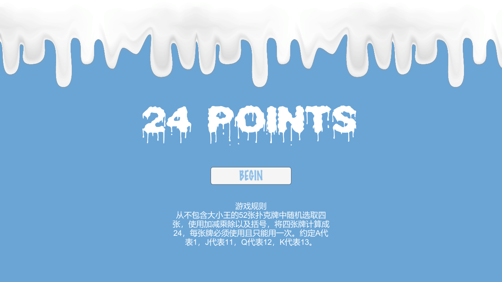
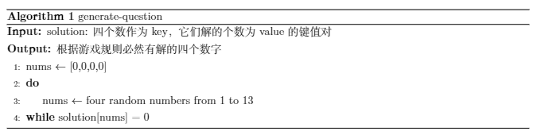

# 24Points

使用 Unity 实现的24点小游戏

24点是一款常见的益智游戏，从不包含大小王的52张扑克牌中随机选取四张，使用加减乘除以及括号，将四张牌计算成24，每张牌必须使用且只能用一次，A、J、Q、K分别代表1、11、12、13。本系统需要实现随机抽取（有解的）四张牌，用户输入表达式进行作答，然后判断表达式是否合并并且等于24。

## 系统界面

## 算法设计

### 题目生成

借助3.1.3搜索答案，计算出四个数字能组成的所有局面的解个数（不考虑相对次序，如 2 2 3 4 和 4 2 2 3 解相同的情况），因为本题目解情况较少，所以将每种情况的解个数以键值对的形式存储于本地solution代码常量中，共1820种局面，其中，无解情况共458个，约占25.2% ，算法伪代码如图14所示：

### 作答判断

将用户提交的答案视为一个字符串表达式，首先判断字符串中是否含有中文字符、空格等影响构建表达式的字符，如有则进行相应转换以及剔除工作，之后判断用户的输入是否使用规定的数字，再构建逆波兰式，若表达式非法，直接反馈给用户非法表达式，否则计算表达式值是否为24，根据答案正确与否返回给用户结果。

**构建逆波兰式步骤：**

- 设置一个符号栈，初始化压入一个#，认为#的优先级低于一切符号。扫描中缀表达式，设当前扫描字符为c：
- 如果c是数字，则进行构造逆波兰式；

- 如果c是运算符，且不是括号：
- 若c的优先级高于符号栈顶运算符，则入栈；

- 若c的优先级低于符号栈顶运算符，则栈顶符号出栈构建逆波兰式，c 继续与新的栈顶符号比较。
- 如果 c 是括号：

- 中缀表达式中的左括号优先级高于一切运算符，栈顶符号的左括号优先级低于一切运算符（就是扫描到左括号直接入符号栈，当栈顶符号是'('时，任何运算符都入栈）。
- 右括号，依次弹出栈顶元素构建逆波兰式，直至栈顶符号为左括号

- 重复上述步骤，直至扫描结束

**逆波兰式计算步骤：**

- 扫描表达式字符串：
- 如果是操作数，直接入栈；

- 如果是操作符op，连续出栈两次，得到操作数x 和 y,计算 x op y，并将结果入栈。

逆波兰式的构建需要遍历一次原始的中缀表达式，计算需要遍历一次构建出的逆波兰式，故总体时间复杂度：，需要一个符号栈，故空间复杂度为：。

### 搜索答案

在不考虑数字和运算符的相对次序，排除运算符优先级影响的情况下，四个数和三个运算符所能组成的表达式相当于如下问题：

- 建立一个栈，初始为空，按如下要求遍历这四个数：
- 如果当前栈中数字少于两个，则当前数字直接入栈；

- 如果当前栈中数字不少于两个，可以选择以下两种选择中的任意一个
- 当前数字直接入栈；

- 弹出两个数，将它们组合为一个数压入栈中，再将当前数入栈
- 最终，要求栈中应当只剩下两个数。

对于四个数，假设为1、2、3、4，一共有5种出入栈方式：

| 1入，2入，12出 12入，3入，123出 123入，4入 |
| ------------------------------------------ |
| 1入，2入，3入，23出 23入，123出 123入，4入 |
| 1入，2入，3入，4入，34出 34入，234出 234入 |
| 1入，2入，3入，23入 23出，4入，234出 234入 |
| 1入，2入，12出 12入，3入，4入，34出 34入   |

所以四个数和三个运算符，一共能列举出5种表达式，它们中缀、后缀表达式如表：

| 中缀表达式              | 后缀表达式         |
| ----------------------- | ------------------ |
| ((A op0 B) op1 C) op2 D | AB op0 C op1 D op2 |
| (A op0 (B op1 C)) op2 D | ABC op1 op0 D op2  |
| A op0 (B op1 (C op2 D)) | ABCD op2 op1 op0   |
| A op0 ((B op1 C) op2 D) | ABC op1 D op2 op0  |
| (A op0 B) op1 (C op2 D) | AB op0 CD op2 op1  |

其中ABCD表示选取的四个数，有种 $P_4^4=24$ 排列方式，$\mathrm{op_i}(1\le i \le 3)$ 表示+、-、*、/4种中的任意一种，共有 $5\times 24\times 4^3=6144$ 种排列方式，我们只需要穷举出所有的表达式共种情况，计算出是否存在结果为24的表达式。
